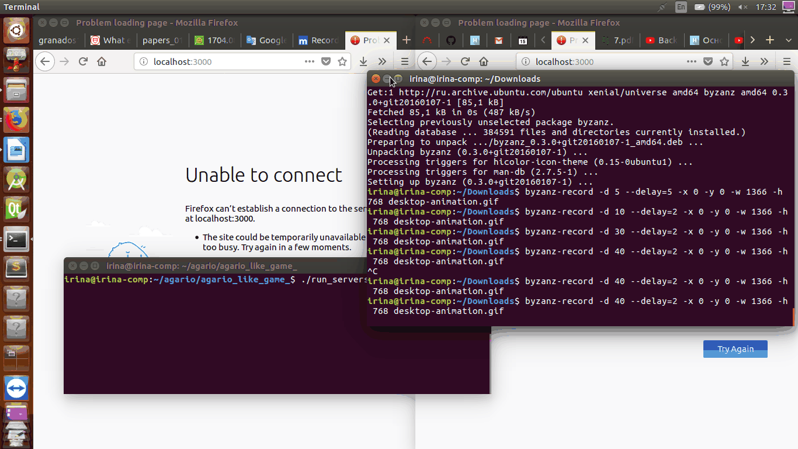

# agario_like_game
This is the game similar to [Agar.io](http://agar.io/).



Dependencies:
```
  $ sudo apt install nodejs-legacy
```

To run two node.js servers (```server.js``` to control blobs' behaviour, ```server2.js``` to control players' scores):
```
  $ ./run_servers.sh
```

NOTE: If you have error like this:
```
Error: listen EADDRINUSE :::3030
```
or
```
Error: listen EADDRINUSE :::3000
```
just use a single command to close all the running node processes:
```
  $ ps aux | awk '/node/{print $2}' | xargs kill -9
```

For start playing visit [localhost](http://127.0.0.1:3000).To move your blob, hold the left mouse button and move the mouse. To become bigger eat smaller blobs, but do not forget, that players whose blobs are bigger than yours can eat you too.

You can open two browser's window and test multiplayer. 
